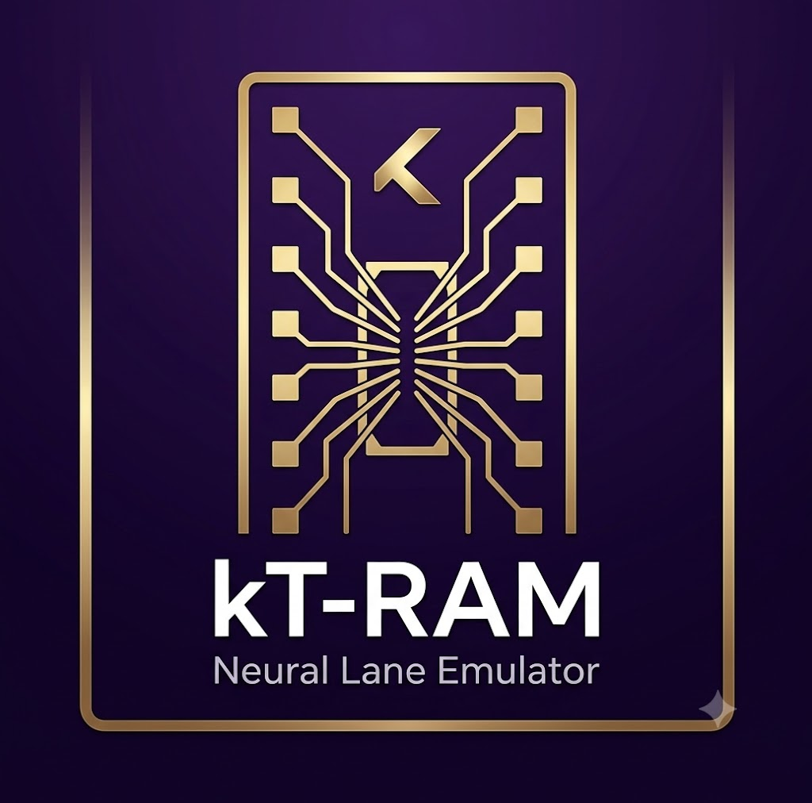
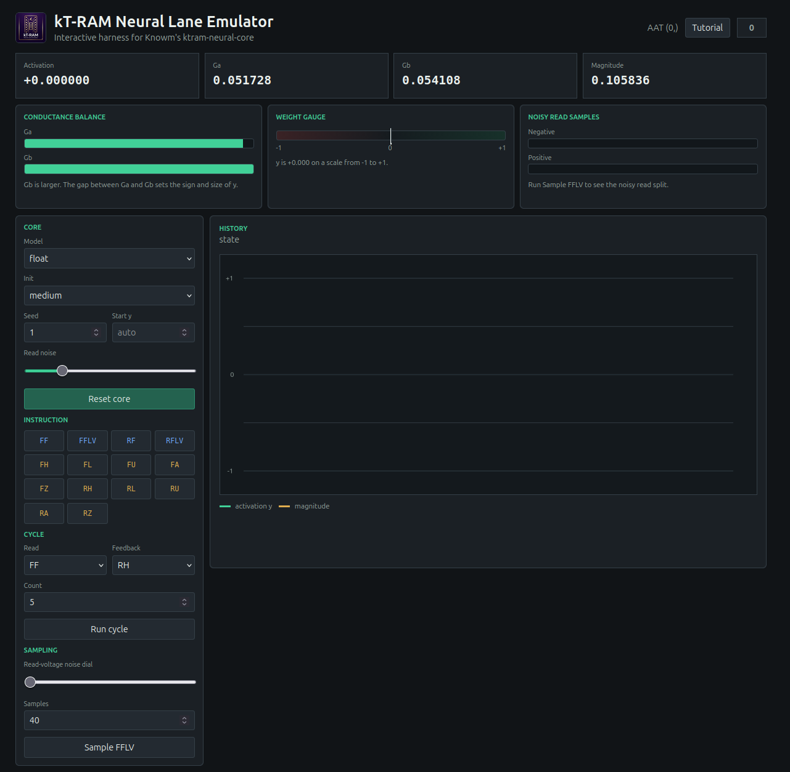

<p align="center">
  
</p>

# kT-RAM Neural Lane Emulator

Browser-based explorer for Knowm's kT-RAM neural lane emulator, with live controls, visual gauges, noisy read sampling, and an optional beginner tutorial.

<p align="center">
  
</p>

This project wraps `ktram-neural-core`, the open Python emulator of the 2-1 kT-RAM neural lane described in Knowm's Neural Lane Emulator article. The goal is to make the emulator easier to explore without living entirely inside a Python prompt or notebook.

The current UI focuses on the first useful surface: one lane, one address space, one differential pair selected by AAT `(0,)`.

## What It Does

- Creates a single-synapse kT-RAM neural lane using `ktram-neural-core`
- Lets you reset the core with different model, init, seed, and read-noise settings
- Runs individual two-letter instructions such as `FF`, `FFLV`, `RH`, and `FL`
- Runs simple read/feedback cycles
- Samples noisy sub-threshold reads
- Shows live activation, conductances, magnitude, history, visual gauges, and sample splits
- Includes a skippable beginner tutorial for new kT-RAM users

## Installation

The launcher scripts check for Python and Git, create `.venv` if needed, install all Python dependencies, start the local UI server, and open the interface in your default browser.

| Platform | Start the UI | Install only | Check environment |
| --- | --- | --- | --- |
| Linux | `./start.sh` | `./start.sh setup` | `./start.sh doctor` |
| macOS | `./start.command` | `./start.command setup` | `./start.command doctor` |
| Windows | `start.bat` | `start.bat setup` | `start.bat doctor` |

To start the server without opening a browser:

```bash
./start.sh --no-browser
```

```bash
./start.command --no-browser
```

```bat
start.bat --no-browser
```

To stop the UI, press `Ctrl+C` in the terminal that started it.

## Tutorial Mode

Click `Tutorial` in the top bar to open an optional beginner path. The first tutorial slice walks through a balanced synapse, conductance reads, simple feedback, noisy low-voltage sampling, and magnitude as stored evidence. Visual cards show the `Ga`/`Gb` balance, a `-1` to `+1` weight gauge, and the positive/negative split from noisy reads.

The tutorial is still early. It is designed to stay skippable so experienced users can continue using the main emulator controls directly.

## Other Commands

| Task | Linux | macOS | Windows |
| --- | --- | --- | --- |
| Open a Python shell | `./start.sh shell` | `./start.command shell` | `start.bat shell` |
| Run the example | `./start.sh example` | `./start.command example` | `start.bat example` |
| Force dependency installation | `./start.sh install` | `./start.command install` | `start.bat install` |
| Show help | `./start.sh help` | `./start.command help` | `start.bat help` |

## Dependency

The emulator is installed from the `chapter-4b` branch of Knowm's repository:

```text
git+https://github.com/knowm/ktram-neural-core.git@chapter-4b#subdirectory=python
```

The Python package name is `ktram-neural-core`; the import name is `ktram_neural_core`.

## Attribution And Notices

This project wraps Knowm Inc.'s `ktram-neural-core` package. The installed package metadata reports:

```text
Author: Knowm Inc.
License: MIT
```

That MIT license label applies to the emulator software package. It does not grant rights to Knowm hardware, devices, patents, or methods modeled by the emulator. Knowm's blog text and images are separate copyrighted materials unless otherwise noted.

See [NOTICE.md](NOTICE.md) for the project notice.
