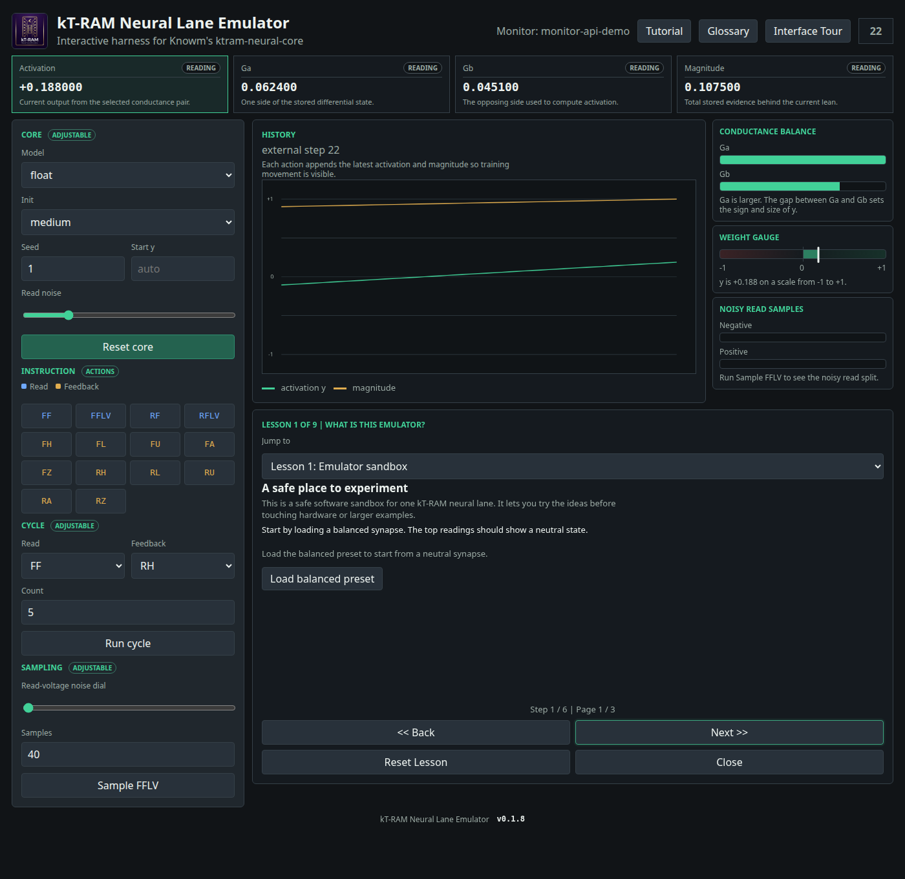

<p align="center">
  
</p>

# kT-RAM Neural Lane Emulator

Current version: `v0.1.8`

Browser-based explorer for Knowm's kT-RAM neural lane emulator, with live controls, visual gauges, noisy read sampling, and an optional beginner tutorial.

<p align="center">
  
</p>

This project wraps `ktram-neural-core`, the open Python emulator of the 2-1 kT-RAM neural lane described in Knowm's [Neural Lane Emulator article](https://knowm.ai/blog/the-neural-lane-emulator/). The goal is to make the emulator easier to explore without living entirely inside a Python prompt or notebook.

The current UI focuses on the first useful surface: one lane, one address space, one differential pair selected by AAT `(0,)`.

## What It Does

- Creates a single-synapse kT-RAM neural lane using `ktram-neural-core`
- Lets you reset the core with different model, init, seed, and read-noise settings
- Runs individual two-letter instructions such as `FF`, `FFLV`, `RH`, and `FL`
- Runs simple read/feedback cycles
- Samples noisy sub-threshold reads
- Shows live activation, conductances, magnitude, history, visual gauges, and sample splits
- Includes a skippable beginner tutorial for new kT-RAM users
- Provides a local Monitor API so external Python programs can stream neural state snapshots into the visual dashboard

## Installation

First, download the project with Git and enter the project folder:

```bash
git clone https://github.com/hfsc2004/kT-emulator.git
cd kT-emulator
```

Then start the app for your platform. The launcher creates `.venv`, installs what the app needs, starts the local UI server, and opens the interface in your default browser.

| Platform | Start the UI |
| --- | --- |
| Linux | `./start.sh` |
| macOS | `./start.command` |
| Windows | `start.bat` |

To start the server without opening a browser:

```bash
./start.sh --no-browser
```

```bash
./start.command --no-browser
```

```bat
start.bat --no-browser
```

To stop the UI, press `Ctrl+C` in the terminal that started it.

## Tutorial Mode

Click `Tutorial` in the top bar to open the beginner path. The tutorial now opens by default and includes nine lessons covering the emulator sandbox, paired conductances, reads, feedback, magnitude, noisy sampling, bigger-system framing, a guided read-train-read challenge, and a Python CLI preview. The CLI preview replays a small Python workflow and drives the live emulator UI when the scripted program runs, so users can watch the readings, chart, and conductance visuals react. Visual cards show the `Ga`/`Gb` balance, a `-1` to `+1` weight gauge, and the positive/negative split from noisy reads.

The tutorial stays skippable so experienced users can continue using the main emulator controls directly.

For teachers and parents: the tutorial is intended as a concrete introduction to adaptive memory ideas. It focuses on visible cause and effect: read the state, apply feedback, then observe how the stored conductance pair changes.

Known limitations: the current UI demonstrates one lane, one selected address, and one visible differential conductance pair. It is an educational emulator surface, not a full hardware simulator UI, and future lessons for logic gates, classifiers, auto-encoders, multi-lane examples, or attractor behavior should wait until those behaviors are runnable in the app.

See [NOTICE.md](NOTICE.md) for attribution and IP/license notes.

## Monitor API

The app includes a local monitor API for external programs that want to drive the visual dashboard while they run. Think of it like connecting an oscilloscope to a circuit: your program sends neural-lane snapshots, and the browser shows activation, conductance balance, magnitude, gauge position, and history.

The monitor API is local to the running app server. If the UI is open at `http://127.0.0.1:8000`, post monitor events to that same origin.

| Endpoint | Method | Purpose |
| --- | --- | --- |
| `/api/monitor/state` | `GET` | Read the latest monitor stream state. |
| `/api/monitor/state` | `POST` | Send one external state snapshot. |
| `/api/monitor/event` | `POST` | Alias for sending one external state snapshot. |
| `/api/monitor/series` | `POST` | Send multiple snapshots at once. |
| `/api/monitor/reset` | `POST` | Clear the monitor stream and return the UI to normal emulator state on the next poll. |

A single snapshot should include `y`, `ga`, and `gb`. `magnitude` defaults to `ga + gb` when omitted.

```json
{
  "source": "my-python-run",
  "label": "train step 12",
  "instruction": "RH",
  "step": 12,
  "y": 0.1372,
  "ga": 0.0584,
  "gb": 0.0443,
  "magnitude": 0.1027
}
```

Minimal Python helper using only the standard library:

```python
import json
import urllib.request
import urllib.error

class MonitorClient:
    def __init__(self, url="http://127.0.0.1:8000", source="user-program"):
        self.url = url.rstrip("/")
        self.source = source
        self.enabled = True

    def send(self, *, label, instruction, step, y, ga, gb, magnitude=None):
        if not self.enabled:
            return None
        event = {
            "source": self.source,
            "label": label,
            "instruction": instruction,
            "step": step,
            "y": y,
            "ga": ga,
            "gb": gb,
        }
        if magnitude is not None:
            event["magnitude"] = magnitude
        data = json.dumps(event).encode("utf-8")
        request = urllib.request.Request(
            f"{self.url}/api/monitor/event",
            data=data,
            headers={"Content-Type": "application/json"},
            method="POST",
        )
        try:
            with urllib.request.urlopen(request, timeout=0.2) as response:
                return json.loads(response.read().decode("utf-8"))
        except (OSError, urllib.error.URLError, TimeoutError):
            # Keep the user's program running even when the visual monitor is closed.
            self.enabled = False
            return None
```

Use that helper to fork your program output: keep printing or saving results normally, and also send a copy of each neural state to the monitor.

```python
from ktram_neural_core import Core

Z = (0,)
core = Core(1, 1, spaces_per_lane=1, num_lanes=1, model="float", init="medium")
monitor = MonitorClient(source="read-train-read-demo")

def report(step, label, instruction, y):
    ga, gb = core.read_gab(0, Z)

    # Your program's normal output still happens.
    print(f"{step:02d} {label:16s} y={y:+.4f} Ga={ga:.4f} Gb={gb:.4f}")

    # A copy of the same state goes to the browser dashboard when it is open.
    monitor.send(
        label=label,
        instruction=instruction,
        step=step,
        y=y,
        ga=ga,
        gb=gb,
    )

step = 0
y = core.evaluate(Z, "FF", noise=0.0)
report(step, "starting read", "FF", y)

for _ in range(10):
    step += 1
    y = core.evaluate(Z, "FF", noise=0.0)
    report(step, "read before RH", "FF", y)

    step += 1
    y = core.evaluate(Z, "RH", noise=0.0)
    report(step, "feedback RH", "RH", y)

step += 1
y = core.evaluate(Z, "FF", noise=0.0)
report(step, "trained read", "FF", y)
```

For a series:

```json
{
  "reset": true,
  "source": "batch-demo",
  "events": [
    { "label": "start", "instruction": "FF", "y": 0.0, "ga": 0.05, "gb": 0.05 },
    { "label": "trained", "instruction": "RH", "y": 0.14, "ga": 0.058, "gb": 0.044 }
  ]
}
```

## Other Commands

| Task | Linux | macOS | Windows |
| --- | --- | --- | --- |
| Open a Python shell | `./start.sh shell` | `./start.command shell` | `start.bat shell` |
| Run the example | `./start.sh example` | `./start.command example` | `start.bat example` |
| Show help | `./start.sh help` | `./start.command help` | `start.bat help` |

## Troubleshooting

If the app does not start, check the local environment:

| Platform | Check environment |
| --- | --- |
| Linux | `./start.sh doctor` |
| macOS | `./start.command doctor` |
| Windows | `start.bat doctor` |

To install dependencies without starting the UI:

| Platform | Install only |
| --- | --- |
| Linux | `./start.sh setup` |
| macOS | `./start.command setup` |
| Windows | `start.bat setup` |

To force dependency installation again:

| Platform | Force install |
| --- | --- |
| Linux | `./start.sh install` |
| macOS | `./start.command install` |
| Windows | `start.bat install` |

## Dependency

The emulator is installed from the `chapter-4b` branch of Knowm's repository:

```text
git+https://github.com/knowm/ktram-neural-core.git@chapter-4b#subdirectory=python
```

The Python package name is `ktram-neural-core`; the import name is `ktram_neural_core`.

## Knowm Resources

- [Knowm Inc.](https://knowm.org)
- [Knowm's Blog](https://knowm.ai)
- [The Neural Lane Emulator](https://knowm.ai/blog/the-neural-lane-emulator/)

## Attribution And Notices

This project wraps [Knowm Inc.](https://knowm.org)'s `ktram-neural-core` package and follows the emulator work published on [Knowm's Blog](https://knowm.ai), including [The Neural Lane Emulator](https://knowm.ai/blog/the-neural-lane-emulator/). The installed package metadata reports:

```text
Author: Knowm Inc.
License: MIT
```

That MIT license label applies to the emulator software package. It does not grant rights to Knowm hardware, devices, patents, or methods modeled by the emulator. Knowm's blog text and images are separate copyrighted materials unless otherwise noted.

See [NOTICE.md](NOTICE.md) for the project notice.
